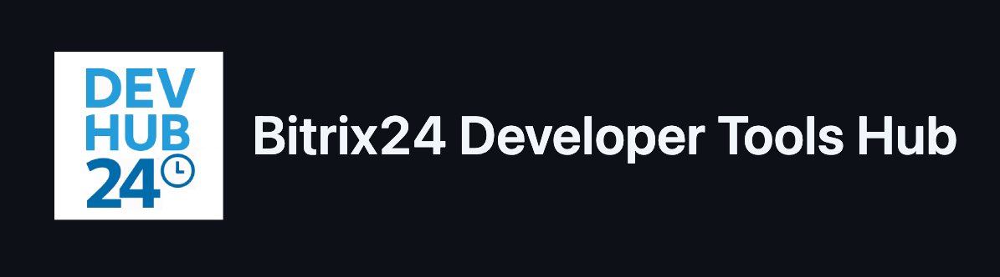

Добро пожаловать в центральный хаб инструментов для разработчиков Bitrix24. Этот репозиторий содержит официальные SDK, UI-компоненты, примеры кода и шаблоны приложений — всё, что нужно для быстрой и удобной разработки под платформу Bitrix24.

## 📚 Содержание

- [SDK и библиотеки](#sdk-и-библиотеки)
  - [PHP SDK](#php-sdk)
  - [JavaScript/Node.js SDK](#javascriptnodejs-sdk)
- [UI-инструменты](#ui-инструменты)
  - [Bitrix24 UI Kit](#bitrix24-ui-kit)
  - [Дизайн-токены](#дизайн-токены)
  - [Иконки](#иконки)
- [Примеры использования](#примеры-использования)
- [Шаблоны приложений](#шаблоны-приложений)
- [Документация](#документация)

## SDK и библиотеки

### PHP SDK

- **b24phpsdk**: Официальная PHP-библиотека для работы с REST API Bitrix24. Поддерживает как OAuth-токены, так и входящие вебхуки, включая автоматическое обновление токенов и оффлайн-очередь.

  [Репозиторий на GitHub](https://github.com/bitrix24/b24phpsdk). Подробнее — в [документации](https://apidocs.bitrix24.ru/api-reference/b24phpsdk/index.html)

### JavaScript/Node.js SDK

- **b24jssdk**: Официальный JavaScript SDK для REST API Bitrix24, работает в браузере и Node.js. Использует современные возможности JavaScript и превосходит устаревшую библиотеку BX24.JS.

  [Репозиторий на GitHub](https://github.com/bitrix24/b24jssdk). Подробнее — в [документации](https://bitrix-tools.github.io/b24jssdk/)

## UI-инструменты

### Bitrix24 UI Kit

- **b24ui**: Набор компонентов для разработки [веб-приложений на основе REST API Bitrix24](https://apidocs.bitrix24.ru/api-reference/widgets/ui-kit/index.html). Реализован на Nuxt и Vue, включает переиспользуемые UI-компоненты для ускорения разработки.

  [Репозиторий на GitHub](https://github.com/bitrix24/b24ui). Подробнее — в [документации](https://bitrix24.github.io/b24ui/)

### Дизайн-токены

- **b24style**: Набор дизайн-токенов для Bitrix24 UI Kit. Позволяет создавать интерфейсы, визуально совместимые с Bitrix24, используя utility-классы Tailwind CSS.

  [Репозиторий на GitHub](https://github.com/bitrix24/b24style). Подробнее — в [документации](https://bitrix-tools.github.io/b24style/)

### Иконки

- **b24icons**: Коллекция SVG-иконок для использования в интерфейсах приложений Bitrix24 (как корпоративных, так и для маркетплейса).

  [Репозиторий на GitHub](https://github.com/bitrix24/b24icons). Подробнее — в [документации](https://bitrix-tools.github.io/b24icons/)

## Примеры использования

- **b24sdk-examples**: Подборка примеров, демонстрирующих использование различных SDK и UI-инструментов Bitrix24 в реальных кейсах.

  [Репозиторий на GitHub](https://github.com/bitrix24/b24sdk-examples). 

## Шаблоны приложений

Готовые шаблоны приложений, которые можно быстро развернуть с помощью Docker. Отличная основа для реализации собственной бизнес-логики под Bitrix24.

> Пока репозиторий приватный — следите за обновлениями!

## Документация

- **b24restdocs**: Официальная документация по REST API Bitrix24, включая справочную информацию и практические руководства для разработчиков.

  [Репозиторий на GitHub](https://github.com/bitrix-tools/b24-rest-docs). Онлайн-версия: [apidocs.bitrix24.ru](https://apidocs.bitrix24.ru/)

## Дополнительные ресурсы

- **crest**: Минималистичная PHP-библиотека для вызова REST-методов Bitrix24 через вебхуки и OAuth 2.0.

  [Репозиторий на GitHub](https://github.com/bitrix-tools/crest)

---

Этот хаб создан для того, чтобы упростить навигацию по инструментам разработки Bitrix24 и ускорить создание интеграций и приложений.
